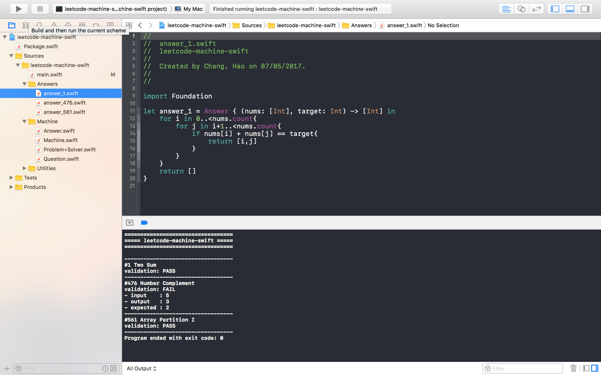

# leetcode-machine-swift


**🆘 Please help set all leetcode problems in `Sources/leetcode-machine/main.swift`. 🆘**

It's always good to have xcode with you when coding swift. Leveraging the autocompletion, type-checking ... features helps you when solving leetcode problems.



## Get started

clone the repo

```bash
$ git clone https://github.com/popodidi/leetcode-machine-swift.git
```

build .xcodeproj

```bash
$ swift package generate-xcodeproj
```

open `leetcode-machine-swift.xcodeproj` and run the executable.

For further details, checkout `Sources/leetcode-machine-swift/main.swift`.

## More

### setup questions

set `Question` object into `Machine`

```swift

Machine.problems = [
    1: Question(name: "Two Sum", inputs: [([2,7,11,15], 9)], outputs: [[0, 1]], validation: { return compare($0, $1) }),
    476 : Question(name: "Number Complement", inputs: [5, 1], outputs: [2, 10]),
    561 : Question(name: "Array Partition I", inputs: [[1,4,3,2]], outputs: [4])
    // {# of question}: {question object}
]
```
- `inputs.count` must be equal to `outputs.count`
- `validation` function should be provided if the outputs are not `Equatable`

### write your answers

write answers

```swift
let answer_1 = Answer { (nums: [Int], target: Int) -> [Int] in
    for i in 0..<nums.count{
        for j in i+1..<nums.count{
            if nums[i] + nums[j] == target{
                return [i,j]
            }
        }
    }
    return []
}
```

set answers to `Machine`

```swift
// set solvers
Machine.solvers = [
    1 : answer_1
    561: answer_561
	// {# of question}: {answer object}
]
```

### run

```swift
Machine.run()        // run all problems
Machine.run(1,2,3,4) // run specific problem(s)
```